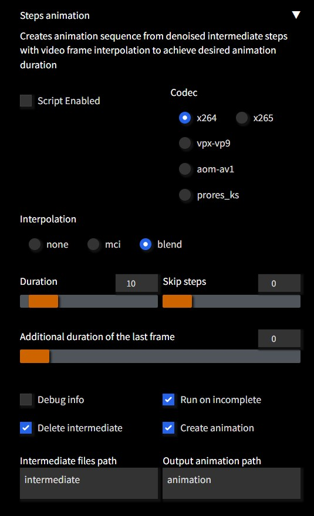

# Steps Animation

Extension to create animation sequence from denoised intermediate steps  
Registers a script in **txt2img** and **img2img** tabs

Creating animation has minimum impact on overal performance as it does not require separate runs  
except adding overhead of saving each intermediate step as image plus few seconds to actually create movie file  

Supports **color** and **motion** interpolation to achieve animation of desired duration from any number of interim steps  
Resulting movie fiels are typically very small (*~1MB being average*) due to optimized codec settings  

### Examples

https://user-images.githubusercontent.com/57876960/212490617-f0444799-50e5-485e-bc5d-9c24a9146d38.mp4
https://user-images.githubusercontent.com/57876960/212487892-b8826f8e-9fc0-4e08-8f4b-16507b1d2cde.mp4

### Notes

- `ffmpeg` must be installed present in system path
- Batch size and count must be set to **1** to use single seed value during entire animation  
- Metadata details are stored in **title / description / artist** sections of a generated movie file  
- Use sampler that creates variations to make more interesting animations
  Good example is `Euler A`  
- Good rule-of-thumb is 1 sec animation duration for each 10 steps  
  That means that real FPS is 10 while interpolation raises it to 30  
- Note: Default max step size in `automatic1111` is 100,  
  you may want to increase it to 200 in `ui-config.json` for longer animations when using some samplers  

### Options

- **Duration**: Target duration of animation in seconds  
  When interpolation is enabled, target duration is approximate  
- **Media Codec**: [Media codec](#codecs) to use when creating animation  
- **Interpolation** method: Used when creating extra frames to archieve duration  
  - **None**: Simply extends duration each image to match desired duration
  - **MCI**: Motion compensated interpolation
  - **Blend**: Color blend interpolation
- **Skip initial steps**: Allows to skip n initial steps when creating animation as they may be overly noisy 
- **Print debug info**: Prints verbose information on console  
- **Run on incomplete data**: If run was interrupted, should animation creation still run on partial results  
  *Note*: This also happens when using some samplers (e.g. DPM adaptive)  
  as they perform early-exit when complete regardless of desired step value  
- **Delete intermediate files**: Delete all generated intermediate (per-step) images after run  
  If not, new files will be appended so you can single animation of multiple generative runs  
- **Create output animation file**: Runs `ffmpeg` to create animation from intermediate files  
  Disable if you want to use intermediate files manually  
- **Path for intermediate files**: Relative to save location  
- **Path for output animation file**: Relative to save location  

### Performance

Dependent on your system and settings used to produce images  

*Example*: Using *Euler A* sampler with 100 steps to produce a 10 sec blend animation of a single trained embedding with 30 frames-per-second takes just ~1 min on nVidia RTX3060  
### Interpolation

Uses `ffmpeg` [minterpolate](https://ffmpeg.org/ffmpeg-filters.html#minterpolate) filter

### Codecs

Compare resulting size & time to create 30sec blend animation from 100 frames:

| codec | size | time |
| ----- | ---- | ---- |
| h264 | 1100 KB | 5.3 s |
| h265 |  350 KB | 6.0 s |
|  vp9 |  700 KB | 6.6 s |
|  av1 |  850 KB | 7.8 s |

Default parameters used for each codec:

- **h264**: `-vcodec libx264 -preset medium -crf 23`
- **h265**: `-vcodec libx265 -preset faster -crf 28`
- **vpx-vp9**: `-vcodec libvpx-vp9 -crf 34 -b:v 0 -deadline realtime -cpu-used 4`,
- **aom-av1**: `-vcodec libaom-av1 -crf 28 -b:v 0 -usage realtime -cpu-used 8 -pix_fmt yuv444p`

## Credits

- Original idea from #5464 by @kevinschaul  
- Previous requests:  
  #1026, #2137, #2094, #2739, #4709, #2137, #41  
